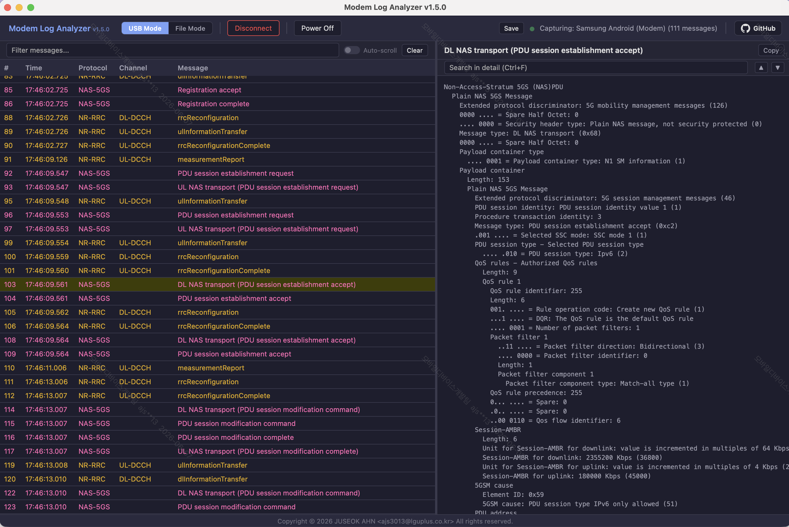

# 📡 Modem Log Analyzer

A web-based real-time DIAG log viewer for NR/LTE RRC and NAS messages.

---

## 💡 Why This Tool?

Modem Log Analyzer connects directly to USB DIAG ports on macOS and Windows (WSL), capturing and decoding NR/LTE RRC and NAS messages in real-time in your browser. Saved log files (.pcap, .hdf, .qmdl, .dlf) can also be loaded and decoded.

Log analysis has always been manual — read messages, check against spec, make a judgment. Existing tools offer text export or copy-paste, but there's always an extra step before automation is possible. Modem Log Analyzer eliminates that step with a single pipeline — capture, decode, analyze — that connects directly to automation.

This pipeline enables automated compliance checks, PHY-layer visualization from raw config, and pass/fail logic for test procedures. Currently it covers RCC and NAS, but the plan is to expand into radio measurements, throughput, and RF conditions — enabling a much wider range of automated field analysis.

---

## ✨ Key Features

- **Real-time Capture**: USB DIAG → scat → tshark loopback decode → instant SSE push
- **Cross-platform**: macOS (native) and Windows (WSL2 + usbipd)
- **Direct USB DIAG**: Access via scat + pyusb, no commercial tools needed
- **File Load**: Open .pcap / .hdf / .qmdl / .dlf files
- **Protocol Support**: NR-RRC, LTE-RRC, NAS-5GS, NAS-EPS
- **AT Command**: Power Off/On (AT+CFUN) without leaving the tool

---

## 🌐 Online Demo

**[Try Online Demo](https://modem-log-analyzer.onrender.com)**

> Note: The demo runs in File Mode only. Upload .pcap or DM log files to decode. USB capture is available in the local version.

---

## 🚀 Quick Start

Download the latest release from [Releases](https://github.com/joostone-ahn/modem-log-analyzer-releases/releases).

1. Download `Modem-Log-Analyzer-vX.X.X.exe`
2. Double-click to run

> **First run:** WSL2, usbipd, scat, tshark are installed automatically (may require reboot).  
> **Subsequent runs:** Instant startup.  
> A `modem-log-analyzer-linux` file is created next to the exe — do not delete it.

---

## 📖 Documentation

- [User Guide (한국어)](https://github.com/joostone-ahn/modem-log-analyzer-releases/blob/main/docs/manual/user-guide-kr.md)
- [User Guide (English)](https://github.com/joostone-ahn/modem-log-analyzer-releases/blob/main/docs/manual/user-guide-en.md)

---

## 📋 Change History

| Version | Date | Changes |
|---------|------|---------|
| v1.2.2 | 2026-06-05 | Fix setup-wsl.bat Ubuntu detection (UTF-16), integrate missing WSL deps, fix same-mode re-click bug |
| v1.2.1 | 2026-06-05 | Fix mode restore bug on page load |
| v1.2.0 | 2026-06-05 | Renamed to Modem Log Analyzer, UX: custom modal dialog system, mode switch save prompt, state management fixes |
| v1.0.0 | 2026-06-03 | Initial release — real-time USB capture, file load, AT command, cross-platform (macOS / Windows WSL) |

---

## 👤 Author

**JUSEOK AHN (안주석)**  
**Email**: ajs3013@lguplus.co.kr  
**Organization**: LG U+  
**Role**: Technical Specialist, Telecommunications Engineer

---

## 📄 License

© 2026 JUSEOK AHN <ajs3013@lguplus.co.kr>. All rights reserved.

This software is provided free of charge for personal and internal use.
You may not modify, distribute, sublicense, or sell copies of this software
without explicit written permission from the author.

Relies on [tshark](https://www.wireshark.org/) (GPL-2.0) and [scat](https://github.com/fgsect/scat) (GPL-2.0) as external subprocesses.
